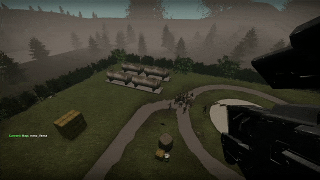

# nmrih-projectileweapon-rocketlauncher
Sourcemod plugin for NMRiH which enables creating custom projectile weapons :D. 

By default, this^ rocket launcher GEP gun is supplied.

ConVars:
- sm_supplycrate_flare        : Add flareguns in supply crates, value set is percentage chance.
- sm_customweapon_friendlyfire: 0 - Never deal damage to teammates, 1 - Deal damage if FF ConVar is set, 2 -  Always damage teammates."

You may edit many aspects such as models, sounds, radius, damage, type etc. 
This is done in sourcemod/configs/customweapon_config.cfg file. 
You may configure your own custom weapon! I'm thinking a plasma launcher would be a good one ;)

Requires: https://github.com/Andersso/SM-WeaponModels  . This plugin makes use of the weapon model natives provides in this plugin.
Just add the weaponmodels.smx plugin from here, into the sourcemod/plugins directory

<pre>

Feel free to use the code or plugin in any way

Credits:
Dysphie  - [NMRiH] Backpack 2     - Vscript Proxy
Andersso -  SM-WeaponModels       - Gun model overwrites, and especially viewmodel override 'hack'
Me                                - everything else
</pre>
